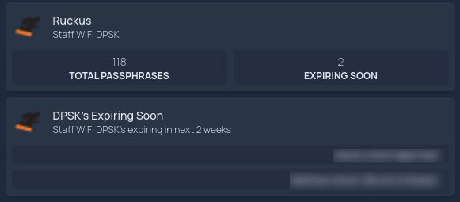

# Ruckus R1 Workers
Inegration with Ruckus R1. Could probably be easily modified to work with other Ruckus products.
## Todo
- [ ] Investigate/implement env variables (if exist in CF) or secrets for tenant and client ID
## Prerequisits
### Create Application Token
1. Login to [Ruckus](https://eu.ruckus.cloud)
2. Navigate Administration > Settings
3. At the bottom of the page is `Application Tokens`
4. `Add Token`
5. Fill in `Application name` and choose a scope (read only for reporting)
6. Make note of the `Client ID` and `Client secret`
7. `Add`
8. Also make a note of the tenant ID, this is randomised string in the url **eu.ruckus.cloud/`f190c7d361174c539f00a08799cd6e62`/t/dashboard**
### API authorisation
To authorise with Ruckus API endpoint you must first create a JWT token, changing `<tenant_id>`, `<client_id>` and `<client_secret>` with the values from the previous step:
```bash
  curl --location --request POST \
  'https://eu.ruckus.cloud/oauth2/token/<tenant_id>' \
  --header 'Content-Type: application/x-www-form-urlencoded' \
  --data-urlencode "grant_type=client_credentials" \
  --data-urlencode "client_id=<client_id>" \
  --data-urlencode "client_secret=<client_secret>"
```
This will output a JWT token that will need to be used for all API requests
> [!CAUTION]
> The end of the token output will also show how long until it expires `,"token_type":"Bearer","expires_in":7199}`, 7199 is seconds, so 2 hours. Therefore any worker will need a function to generate this JWT token dynamically.
### Querying DPSK
Ruckus API requests mostly need to know pool ID and perhaps other specific ID's so it knows which DPSK network you want to query. To get all the DPSK info, run the following, replacing `<JWT_token>` with your previously created token:
```bash
curl -X GET \
  https://api.eu.ruckus.cloud/dpskServices \
  -H "Authorization: Bearer <JWT_token>"
```
> [!NOTE]
> The output is not particularly readable, best to copy the output to a text editor and save it as a `.json` filetype. Then open with a web browser like Firefox for a "prettified" layout

The output will look something like
```json
    {
      "id": "6052530604ef400ca668cb2c353df898",
      "name": "Staff-DPSK-service",
      "passphraseFormat": "KEYBOARD_FRIENDLY",
      "passphraseLength": 18,
      "policyDefaultAccess": true,
      "networkIds": [
        "6052530604ef400ca668cb2c353df898"
      ],
      "ssids": [
        "Staff"
      ],
      "deviceCountLimit": null,
      "policySetId": null,
      "expirationType": "YEARS_AFTER_TIME",
      "expirationOffset": 1,
      "expirationDate": null,
      "createdDate": null,
      "lastModifiedDate": "2025-03-05T02:54:33Z",
      "isReferenced": true,
      "networkCount": 1,
      "isEnforced": false,
      "identityId": "6f16feae-4273-4835-9b6c-4deb1f615847",
      "identityGroupId": "6f16feae-4273-4835-9b6c-4deb1f615847"
    },
```
`"id":` is the pool id
## Expiring DPSK Worker
This worker is for querying and manipulating API calls between Ruckus R1 and Homepage (or could quite easily be adjusted to work with a different UI frontend), to show some basic data for a given SSID and show usernames of clients who have a DPSK passphrase that expires within the next 2 weeks. This so we have easy visibility and can send users a new DPSK passphrases before their current one expires.
### Deployment
1. Create the Cloudflare worker
2. Create and bind Secrets Store values (RUCKUS_CLIENT_ID and RUCKUS_CLIENT_SECRET)
3. Set a cron schedule (every 12 hours)
> [!NOTE]
> See `README.md` at the root of this repo for instructions on these parts of the deployment
4. Add your Pool and Tenant ID's to `expiringDpsk.js`
```javascript
...
    // --- User-provided constants ---
    const POOL_ID = "<YOUR POOL ID>";
    const TENANT_ID = "<YOUR TENANT ID>";
...
```
5. Copy `expiringDpsk.js` to your Cloudflare worker and deploy
### Homepage integration
1. Copy the [Ruckus icon](../assets/icons/ruckus.png) into your `homepage/config/icons` directory
2. Open `homepage/config/services.yaml` copy in the below to the appropriate services group, changing any `<variables>`
3. Copy in [`homepage.yaml`](dashboards/homepage.yaml)

Your Homepage dashboard should now look something like

